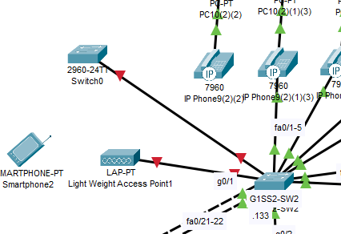

```
G1SS2-R3#sh ip ospf neighbor


Neighbor ID     Pri   State           Dead Time   Address         Interface
1.1.1.1           1   FULL/BDR        00:00:33    11.0.0.5        GigabitEthernet0/0/0
2.2.2.2           1   FULL/BDR        00:00:32    192.168.2.130   FastEthernet0/0.30
2.2.2.2           1   FULL/BDR        00:00:32    192.168.2.2     FastEthernet0/0.10
2.2.2.2           1   FULL/BDR        00:00:32    192.168.2.34    FastEthernet0/0.40
2.2.2.2           1   FULL/BDR        00:00:32    192.168.2.66    FastEthernet0/0.50

G1SS2-R3#sh ip route
Codes: L - local, C - connected, S - static, O - OSPF

Gateway of last resort is 11.0.0.5 to network 0.0.0.0

     10.0.0.0/8 is variably subnetted, 2 subnets, 2 masks
C       10.0.0.8/30 is directly connected, GigabitEthernet0/2/0
L       10.0.0.10/32 is directly connected, GigabitEthernet0/2/0
     11.0.0.0/8 is variably subnetted, 4 subnets, 2 masks
O       11.0.0.0/30 [110/2] via 11.0.0.5, 00:33:56, GigabitEthernet0/0/0
C       11.0.0.4/30 is directly connected, GigabitEthernet0/0/0
L       11.0.0.6/32 is directly connected, GigabitEthernet0/0/0
O       11.0.0.8/30 [110/3] via 11.0.0.5, 00:33:56, GigabitEthernet0/0/0
     192.168.2.0/24 is variably subnetted, 11 subnets, 4 masks
C       192.168.2.0/27 is directly connected, FastEthernet0/0.10
L       192.168.2.3/32 is directly connected, FastEthernet0/0.10
C       192.168.2.32/27 is directly connected, FastEthernet0/0.40
L       192.168.2.35/32 is directly connected, FastEthernet0/0.40
C       192.168.2.64/27 is directly connected, FastEthernet0/0.50
L       192.168.2.67/32 is directly connected, FastEthernet0/0.50
O       192.168.2.96/27 [110/12] via 11.0.0.5, 00:33:56, GigabitEthernet0/0/0
C       192.168.2.128/28 is directly connected, FastEthernet0/0.30
L       192.168.2.131/32 is directly connected, FastEthernet0/0.30
O       192.168.2.144/28 [110/12] via 11.0.0.5, 00:33:56, GigabitEthernet0/0/0
O       192.168.2.160/30 [110/11] via 11.0.0.5, 00:33:56, GigabitEthernet0/0/0
O*E2 0.0.0.0/0 [110/1] via 11.0.0.5, 00:33:56, GigabitEthernet0/0/0

G1SS2-R3#
```


```
G1SS2-SW2#sh vtp status

VTP Version capable             : 1 to 2
VTP version running             : 1
VTP Domain Name                 : G1SS.com
VTP Pruning Mode                : Disabled
VTP Traps Generation            : Disabled

Feature VLAN : 
--------------
VTP Operating Mode                : Client
Maximum VLANs supported locally   : 255
Number of existing VLANs          : 9


G1SS2-SW2#sh vlan brief

VLAN Name                             Status    Ports
---- -------------------------------- --------- -------------------------------
1    default                          active    
10   Dolgozok_Data                    active    Fa0/1, Fa0/2, Fa0/3, Fa0/4
                                                Fa0/5, Fa0/6, Fa0/7
30   management                       active    
40   VOICE                            active    Fa0/1, Fa0/2, Fa0/3, Fa0/4
                                                Fa0/5
50   wireless                         active    Gig0/1
1002 fddi-default                     active    
1003 token-ring-default               active    
1004 fddinet-default                  active    
1005 trnet-default                    active    


G1SS2-SW2#show interfaces trunk
Port        Mode         Encapsulation  Status        Native vlan
Po1         on           802.1q         trunking      1
Gig0/2      on           802.1q         trunking      1

Port        Vlans allowed on trunk
Po1         10,30,40,50
Gig0/2      10,30,40,50


```



```
G1SS2-SW2#sh port-security interface fastEthernet 0/1
Port Security              : Enabled
Port Status                : Secure-shutdown
Violation Mode             : Restrict
Aging Time                 : 0 mins
Aging Type                 : Absolute
SecureStatic Address Aging : Disabled
Maximum MAC Addresses      : 1
Total MAC Addresses        : 0
Configured MAC Addresses   : 0
Sticky MAC Addresses       : 0
Last Source Address:Vlan   : 0000.0000.0000:0
Security Violation Count   : 1
```
